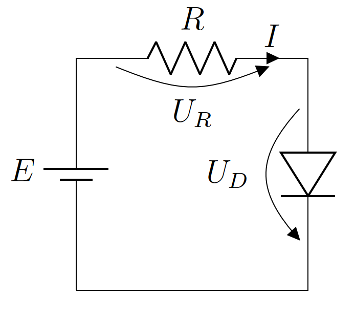

Newton method to solve nonlinear circuits
=========================================

In this tutorial we will see how ForwardModeAD can be used to easily implement the `Newton method <https://en.wikipedia.org/wiki/Newton%27s_method>`_ to solve nonlinear equations.
As an application, we will demo how this can be used to solve nonlinear electric circuits.

Newton method
*************

Suppose we want to solve a nonlinear equation :math:`f(x)=0`. The Newton rule is an iterative algorithm that starts with an initial guess of the root :math:`x_0` and uses the
following update rule

.. math::

   x_{n+1} = x_n - \frac{f(x_n)}{f'(x_n)}.

In general, but with some pathological exceptions, the update rule will converge quadratically to a root of the function.
As we need the derivative of the function, the algorithm is easily implemented with ``ForwardModeAD``.

We also need a stopping criteria for the update rule, here we choose to stop when :math:`|f(x_n)|<tol`. Where :math:`tol` is a chosen tolerance.

Now we have everything we need to implement, the algorithm, let us demo it by finding the root of the function

.. math::
    
    f(x) = e^{-x}\sin(x) - \log(x)

using initial guess :math:`x_0=0.5` and tolerance :math:`10^{-6}`.

.. code-block:: chapel

    use ForwardModeAD;

    proc f(x) {
        return exp(-x) * sin(x) - log(x);
    }

    var tol = 1e-6, // tolerance to find the root
        cnt = 0, // to count number of iterations
        x0 = 0.5, // initial guess
        valder = f(initdual(x0)); // initial function value and derivative

    writeln("Iteration ", cnt, " x = ", x0, " residual = ", valder.value);

    while abs(valder.value) > tol {
        x0 -= valder.value / valder.derivative;
        valder = f(initdual(x0));
        cnt += 1;
        writeln("Iteration ", cnt, " x = ", x0, " residual = ", valder.value);
    }

.. code-block::

    Iteration 0 x = 0.5 residual = 0.983933
    Iteration 1 x = 1.05953 residual = 0.244472
    Iteration 2 x = 1.28662 residual = 0.0131033
    Iteration 3 x = 1.3002 residual = 4.13149e-05
    Iteration 4 x = 1.30025 residual = 4.13897e-10

As you can see, the algorithm quickly converges to :math:`x \approx 1.30025`, which `is the correct root <https://www.wolframalpha.com/input?i=exp%28-x%29*sin%28x%29+-+ln%28x%29+%3D+0>`_.

Nonlinear circuit example
*************************

Solving nonlinear equations is very common in most if not all scientific computing applications.
To make our example more concrete, let us demo how the previous algorithm can be used to analyze the following nolinear circuit, 
using values :math:`R=1~\textrm{k}\Omega` and :math:`E=5~\textrm{V}`.

The resistor is modeled via Ohm law :math:`U_R=RI` and the diode via Schockley equation :math:`I=I_S\left(e^\frac{V_D}{V_T}-1\right)`, with :math:`I_S\approx10^{-1}` and :math:`V_T\approx25~\textrm{mV}`.

By Kirchoff voltage law we have

.. math::

    U_R + U_D - E = 0

Subsituting the previous values and equations we get

.. math::
    g(V_D) = 10^{-9}\left(e^{40V_D}-1\right) + V_D - 5 = 0

this can be now solved with our previously developed newton method

.. code-block:: chapel

    proc g(vd) {
        return 1e-9 * (exp(40 * vd) - 1) + vd - 5;
    }

    var x0 = 0.0,
        valder = g(initdual(x0));

    while abs(valder.value) > tol {
        x0 -= valder.value / valder.derivative;
        valder = g(initdual(x0));
    }

    writeln("x0 = ", x0);

.. code-block::

    x0 = 0.555374

which is indeed a typical voltage value for a diode.